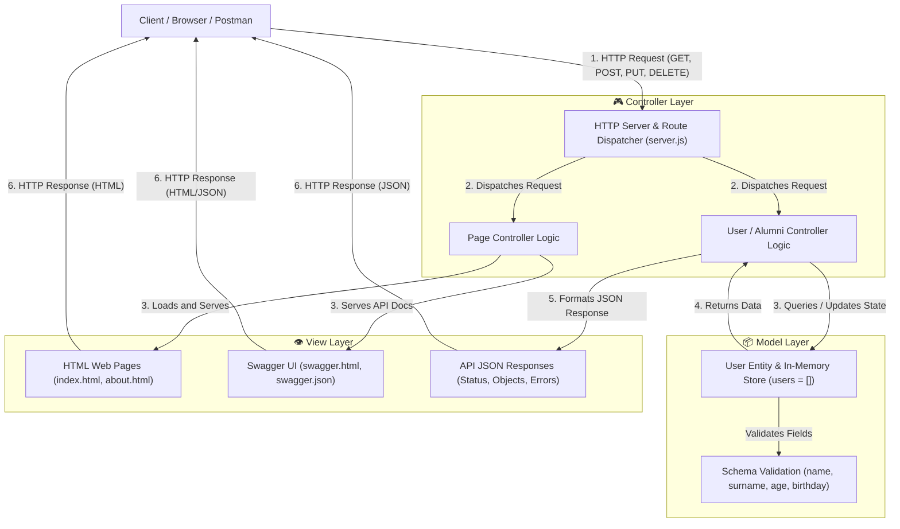

# Alumni Tracking System

This is a comprehensive Alumni Tracking System designed to manage, connect, and engage with university/school alumni. The platform provides a centralized hub for tracking alumni data, fostering networking opportunities, and maintaining strong relationships between the institution and its graduates.

## 🚀 Technologies Used

This project is built using a modern, full-stack architecture and is fully containerized for easy deployment and development.

*   **Frontend:** HTML5, CSS3, Vanilla JavaScript
*   **Backend:** Node.js
*   **Database:** PostgreSQL
*   **Containerization:** Docker & Docker Compose

## ✨ Key Features (Planned/Implemented)

*   **Alumni Profiles:** Detailed profiles for each alumnus, including contact information, graduation year, current employment, and location.
*   **Directory Search:** Easy-to-use search and filtering capabilities to find specific alumni.
*   **Data Management:** Secure backend API for creating, reading, updating, and deleting alumni records.
*   **Responsive Design:** A clean, accessible, and responsive user interface built with standard web technologies.

## 🐳 Getting Started with Docker

The easiest way to get the project up and running is by using Docker. This ensures that the application runs in a consistent environment regardless of your local setup.

### Prerequisites

*   [Docker](https://docs.docker.com/get-docker/) installed on your machine.
*   [Docker Compose](https://docs.docker.com/compose/install/) installed (usually comes with Docker Desktop).

### Running the Application

1.  **Clone the repository:**
    ```bash
    git clone <your-repository-url>
    cd <your-repository-directory>
    ```

2.  **Start the containers:**
    Run the following command in the root directory of the project:
    ```bash
    docker-compose up --build
    ```
    *(Note: Add the `-d` flag (`docker-compose up -d --build`) to run the containers in detached mode / in the background.)*

3.  **Access the application:**
    *   **Frontend:** Open your browser and navigate to `http://localhost:<frontend-port>` (Replace `<frontend-port>` with the actual port defined in your docker-compose, e.g., 80 or 8080).
    *   **Backend API:** The API will be accessible at `http://localhost:<backend-port>` (e.g., 3000).
    *   **Database:** PostgreSQL will be running on `localhost:5432`.

### Stopping the Application

To stop the running containers, press `Ctrl+C` in the terminal where `docker-compose up` is running. If you ran it in detached mode, use:
```bash
docker-compose down
```

## 📚 API Documentation (Swagger)

The project includes interactive API documentation powered by Swagger UI. You can use it to explore all available endpoints, view required request payloads, and test the API directly from your browser.

*   **Swagger UI:** Access the visual documentation at `http://localhost:8080/api/swagger`
*   **Swagger JSON:** Access the raw OpenAPI specification at `http://localhost:8080/api/swagger.json`

## 🏛️ MVC (Model-View-Controller) Architecture

The application adopts the **Model-View-Controller (MVC)** software architectural pattern. This pattern separates application concerns into three interconnected components, ensuring code modularity, maintainability, and scalability.



---

### 1. MVC Component Definitions in this Application

| Component | Responsibility in this Application | Implementation Details |
| :--- | :--- | :--- |
| **Model (M)** | Manages application data, schema structure, constraints, and business state. | In-memory `users` array in `server.js` holding User/Alumni records (`id`, `name`, `surname`, `age`, `birthday`), with validation logic enforcing field types and presence. |
| **View (V)** | Presents information to the end user and client applications. | Static web pages (`index.html`, `about.html`), interactive API documentation interface (`swagger.html`), and formatted JSON data returned to API clients. |
| **Controller (C)** | Accepts input, parses HTTP requests, coordinates with the Model, and determines the appropriate View/response. | HTTP server routing and request handlers in `server.js` that handle CRUD operations (`GET`, `POST`, `PUT`, `PATCH`, `DELETE`) on `/api/users`, static file serving, and utility routes. |

---

### 2. Current Project Structure & MVC File Mapping

The current repository layout and how each file maps to MVC principles:

```text
alumni/
├── controllers/
│   ├── apiUserController.js     # [CONTROLLER] REST API controller handling JSON requests & responses
│   └── userController.js        # [CONTROLLER] Web UI controller rendering HTML views & managing pages
├── routes/
│   ├── apiUserRoutes.js         # [ROUTER] Maps /api/users endpoints to ApiUserController
│   └── userRoutes.js            # [ROUTER] Maps /users endpoints to UserController
├── models/
│   └── userModel.js             # [MODEL] In-memory User data model with full CRUD functions & validation
├── views/
│   └── users.html               # [VIEW] Alumni Directory table & user registration form template
├── index.html                   # [VIEW] Home page UI for users
├── about.html                   # [VIEW] About us page UI
├── swagger.html                 # [VIEW] Swagger UI documentation presentation
├── swagger.json                 # [VIEW / CONTRACT] OpenAPI 3.0 API specifications (updated with all endpoints)
├── server.js                    # [SERVER ENTRY] HTTP server listener and top-level route coordinator
├── README.md                    # Project and architectural documentation
├── .postman/                    # API client configuration
│   └── resources.yaml           # Postman workspace configuration
└── postman/                     # API testing definitions
    └── globals/
        └── workspace.globals.yaml # Postman global variables
```

#### Detailed Breakdown of Existing Files:

*   **`models/userModel.js` (Model Layer)**
    *   Encapsulates the Alumni / User data entity and business state in an in-memory collection without requiring an external database.
    *   **CRUD Operations:**
        *   `getAll()` / `findAll()`: Returns all user records.
        *   `getById(id)` / `findById(id)`: Retrieves a specific user by identifier.
        *   `create(userData)`: Validates required fields (`name`, `surname`, `age`, `birthday`), auto-increments unique IDs, and stores the record.
        *   `update(id, updateData)`: Full replacement (PUT) updating all required user fields.
        *   `patch(id, updateData)` / `partialUpdate(id, updateData)`: Partial update (PATCH) updating only supplied attributes.
        *   `delete(id)` / `deleteById(id)`: Removes a user from the collection.
        *   `clear()`: Resets in-memory storage (useful for automated testing).
    *   **Validation:** Built-in `validate(data, isPartial, operation)` logic ensuring data integrity and meaningful error messages.

*   **`routes/apiUserRoutes.js` and `routes/userRoutes.js` (Routing Layer)**
    *   Decouples URL matching and HTTP verbs from the core server configuration.
    *   `apiUserRoutes.js`: Captures all `/api/users*` calls (`GET`, `POST`, `PUT`, `PATCH`, `DELETE`) and executes `ApiUserController`.
    *   `userRoutes.js`: Captures all `/users*` calls (`GET`, `POST`, `PUT`, `PATCH`, `DELETE`) and executes `UserController`.

*   **`controllers/apiUserController.js` (REST API Controller)**
    *   Processes JSON payloads from client applications, mobile apps, or Postman.
    *   Interacts with `UserModel` to perform CRUD operations and returns standard HTTP status codes (`200 OK`, `201 Created`, `400 Bad Request`, `404 Not Found`).
    *   Provides `getAll`, `getById`, `create`, `update`, `patch`, and `delete`.

*   **`controllers/userController.js` (Web UI Controller)**
    *   Renders HTML views and presentation layouts for browser visitors.
    *   Generates the Alumni Directory table (`GET /users`), individual alumni profile cards (`GET /users/:id`), and handles web form submissions.

*   **`server.js` (Server Entry & Top-Level Coordinator)**
    *   Initializes the HTTP server on port 8080.
    *   Acts as the central server entry: delegates domain requests to `handleApiUserRoutes` and `handleUserRoutes`, and serves static pages (`/`, `/about`, `/api/swagger`).

*   **`index.html` (View - Home)**
    *   Presents the landing page of the Alumni Network with navigation bar, hero banner, feature highlights, and styling.

*   **`about.html` (View - About Us)**
    *   Presents organizational information, mission statement, vision, and project announcements.

*   **`swagger.html` (View - API Explorer)**
    *   Embeds Swagger UI bundle to provide an interactive graphical interface for exploring and executing API requests.

*   **`swagger.json` (View / Data Contract)**
    *   Specifies OpenAPI 3.0 definitions for all `/api/*` endpoints, request schemas, parameters, and status responses.

*   **`postman/` and `.postman/` (Testing & Workspace)**
    *   Maintains workspace configurations and globals for automated endpoint testing and team collaboration.

---

### 3. Recommended Modular MVC Directory Structure

As the application grows, separating `server.js` into modular directories and files enhances maintainability, testability, and adherence to clean code principles:

```text
alumni/
│
├── controllers/                 # [CONTROLLERS] Request handling & business coordination
│   ├── userController.js        # CRUD logic for /api/users
│   ├── pageController.js        # Serves HTML pages (index, about)
│   └── utilController.js        # Health check, hello, and sum helper actions
│
├── models/                      # [MODELS] Data models, schemas, and persistence
│   └── userModel.js             # User data structure, in-memory store / database queries, and validation
│
├── views/                       # [VIEWS] Presentation templates and static documents
│   ├── index.html               # Home page template
│   ├── about.html               # About page template
│   └── swagger.html             # Swagger UI documentation page
│
├── routes/                      # [ROUTING] Route mapping and endpoint definitions
│   ├── userRoutes.js            # Routes for /api/users (GET, POST, PUT, PATCH, DELETE)
│   ├── pageRoutes.js            # Routes for web pages (/, /about)
│   └── swaggerRoutes.js         # Routes for Swagger documentation (/api/swagger, /api/swagger.json)
│
├── docs/                        # API specifications and documentation assets
│   └── swagger.json             # OpenAPI specification definition
│
├── postman/                     # Postman collections and environment variables
│   ├── resources.yaml
│   └── globals/
│       └── workspace.globals.yaml
│
├── server.js                    # Application entry point: initializes server, imports routes & middleware
└── README.md                    # Project documentation
```

#### Directory Responsibilities in the Modular Structure:

1.  **`models/` (Data & Logic Layer):**
    *   Contains data representations and access logic.
    *   Independent of HTTP request/response objects (`req`, `res`).
    *   Handles data integrity, sanitization, and database interactions (e.g., PostgreSQL / ORM).

2.  **`views/` (Presentation Layer):**
    *   Contains files directly rendered or sent to the client browser.
    *   Decoupled from business rules and data queries.

3.  **`controllers/` (Application Logic Layer):**
    *   Accepts HTTP requests, validates incoming parameters and bodies.
    *   Invokes appropriate Model functions to retrieve or mutate data.
    *   Selects the appropriate response view or sends serialized JSON with proper HTTP status codes (`200`, `201`, `400`, `404`, `500`).

4.  **`routes/` (Routing Layer):**
    *   Maps HTTP verbs (`GET`, `POST`, `PUT`, `PATCH`, `DELETE`) and URL paths to specific controller handler functions.
    *   Organizes endpoints cleanly by domain resource (e.g., users, pages, swagger).

---

### 4. Data Flow Walkthrough (Example: Creating a User)

To illustrate how MVC components interact during execution:

1.  **Request Initiation:** A client sends a `POST /api/users` request with JSON payload:
    ```json
    { "name": "Jane", "surname": "Doe", "age": 24, "birthday": "2000-05-15" }
    ```
2.  **Routing & Controller:** 
    *   The server router matches `POST /api/users` and invokes the User Controller.
    *   The controller reads and parses the request stream body.
3.  **Model Validation & Storage:**
    *   The controller passes data to the User Model.
    *   The model checks required fields (`name`, `surname`, `age`, `birthday`).
    *   The model generates an `id`, stores the new record, and returns the entity.
4.  **View / Response Rendering:**
    *   The controller sets HTTP status `201 Created` and header `Content-Type: application/json`.
    *   The controller sends the serialized response object `{ message: "User created successfully", user: newUser }` back to the client.
